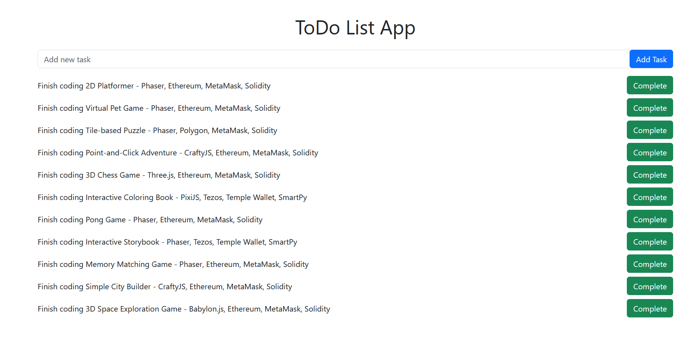

# ToDo List DApp Frontend

[](https://opensource.org/licenses/MIT)


## Table Of Content

- [Description](#description)
- [Technology](#technology)
- [Installation](#installation)
- [Usage](#usage)
- [Tools and Libraries](#tools-and-libraries)
- [Contributing](#contributing)
- [Contact](#contact)
- [License](#license)


## Description

The ToDo List DApp is a decentralized application built on Ethereum that allows users to manage their tasks securely and transparently using smart contracts. It is designed to help individuals maintain their task lists without relying on centralized platforms.


## Technology

- **React**: For building the user interface.
- **Ethers.js**: A library to interact with the Ethereum blockchain.
- **Bootstrap**: For styling the application.
- **MetaMask**: As the Ethereum wallet provider.


<p>Deployed website: <strong><a href="https://blockchaincyberpunk1.github.io/blockchain-todo-list-frontend">https://blockchaincyberpunk1.github.io/blockchain-todo-list-frontend</a></strong>

<p align="center">
  <br>
Voting System DApp Interface
</p>


## Installation

To run this project, follow these steps:

1. **Clone the repository**:
   ```bash
   git clone https://github.com/blockchaincyberpunk1/blockchain-todo-list-frontend.git
   cd blockchain-todo-list-frontend
   ```
2. **Install dependencies**:
   ```bash
   npm install
   ```
3. **Run the application**:
    ```bash
    npm start
    ```


## Tools and Libraries

- **React**: JavaScript library for building user interfaces.
- **ethers.js**: A complete Ethereum wallet implementation and utilities in JavaScript (and TypeScript).
- **Bootstrap**: Extensive list of components and Bundled Javascript plugins.


## Usage
 
To use the app:

1. Ensure MetaMask is installed and logged in.
2. Visit the application URL (usually http://localhost:3000).
3. Interact with the application to manage your tasks.


## Contribution
 
Contributions are welcome! Please feel free to submit any issues or pull requests.


## Contact

Feel free to reach out to me on my email:
thepolyglot8@gmail.com


## License

[](https://opensource.org/license/MIT)


